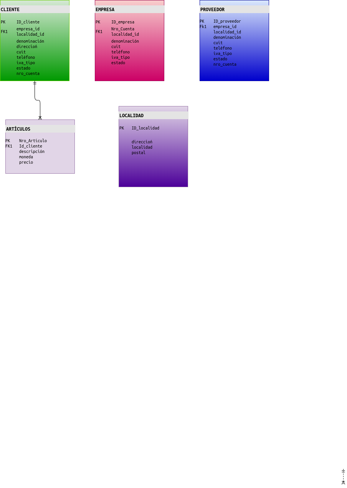

_...En proceso de desarrollo..._

***
***

 ***SAC*** Sistema Administrativo Contable 

***
{
  label: 'build',  // (Optional) Badge label
  message: 'passed',  // (Required) Badge message
  labelColor: '#555',  // (Optional) Label color
  color: '#4c1',  // (Optional) Message color

  // (Optional) One of: 'plastic', 'flat', 'flat-square', 'for-the-badge' or 'social'
  // Each offers a different visual design.
  style: 'flat',
}

***

***Presentación***:
 
 Sac es un software genérico que administra tareas contable, a modo de organizador comercial.
 Permite observar los movimientos de la entidad laboral.
 Otorga flexibilidad, simple gestión, sin necesidad de conocimientos contables.
 

***Sus funcionalidades generales son***:
 
- Proveer información sobre los movimientos
- Cargar los datos del cliente
- Cargar datos de ventas
- Cargar datos de cobros
- Cargar artículos

***Requisitos***:

- Crear la entidad Clientes(compradores)
- Crear la entidad Artículos
- Crear la entidad Domicilio
- Registrar la entidad Clientes en formulario
- Listar Clientes
- ABM Clientes:
   * Alta
   * Baja
   * Modificación
- ABM Artículos:
   * Alta
   * Baja
   * Modificación

## Tablas:

[Trello](https://trello.com/b/wgBQkeNf/sac-sistema-administrativo-contable)

